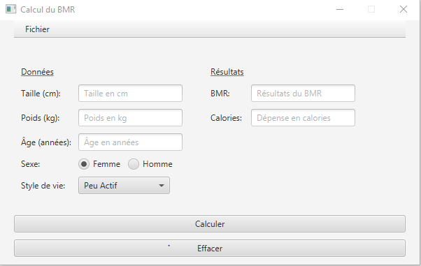
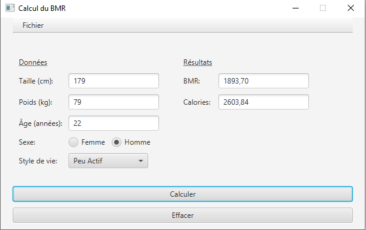
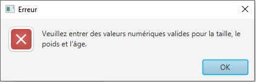

# BMR Calculator

## About the project

The BMR Calculator is a JavaFX application that calculates the Basal Metabolic Rate (BMR) based on user inputs such as weight, height, age, and gender. It estimates the daily caloric needs of individuals by multiplying the BMR with an activity factor, allowing users to manage their dietary requirements effectively.

## Key Features

- **User Input:** Collects weight, height, age, and gender through input fields.
- **Calculation:** Computes BMR using the following formulas:
  - For Women: `BMR = 9.6 * weight + 1.8 * height - 4.7 * age + 655`
  - For Men: `BMR = 13.7 * weight + 5 * height - 6.8 * age + 66`
- **Activity Level:** Allows users to select an activity level from a dropdown menu to adjust their caloric needs:
  - Sedentary: 1.2
  - Lightly Active: 1.375
  - Moderately Active: 1.55
  - Very Active: 1.725
  - Super Active: 1.9
- **Error Handling:** Displays error messages if any input fields are empty or contain invalid data.
- **Clear Functionality:** Includes a button to clear all input fields and results.
- **Input Filters:** Restricts input fields to numeric values only.
- **Menu Bar:** Features a simple menu with an option to exit the application.

## How to Run It

1. **Prerequisites:** Ensure you have Maven installed on your system.
2. **Open the project with IntelliJ IDEA.**
3. **Access the Maven window:** In the right panel, click on the **Maven** tab.
4. **Run the application:** Under the **JavaFX** section, double-click on `javafx:run`.
5. **The application should open.**

## Screenshots

